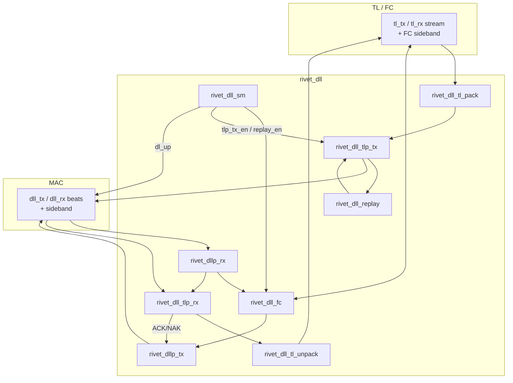

# DLL (`rtl/pcie_ctrl/dll`)

Gen2 Data Link Layer (`pclk`). Detail / roadmap: [docs/dll.md](../../../docs/dll.md).

## Block diagram



## Hierarchy

```text
rivet_dll
├── rivet_dll_sm
├── rivet_dll_fc
├── rivet_dll_tl_pack
├── rivet_dll_tl_unpack
├── rivet_dll_replay
├── rivet_dllp_tx          # uses rivet_dll_crc16
├── rivet_dllp_rx          # uses rivet_dll_crc16
├── rivet_dll_tlp_tx       # uses rivet_dll_lcrc32
└── rivet_dll_tlp_rx       # uses rivet_dll_lcrc32
```

## Modules

| Module | Role |
|--------|------|
| `rivet_dll` | Top; FC + DL SM + TL stream + TLP/ACK/NAK/replay |
| `rivet_dll_sm` | DLCMSM: Inactive / Init / Active (+ replay busy); `dl_up` |
| `rivet_dll_fc` | InitFC1/2, UpdateFC, CL/CC, TX credit gate |
| `rivet_dllp_tx` | Build 8-byte DLLP + CRC-16 → MAC beat |
| `rivet_dllp_rx` | Parse MAC DLLP beat; CRC check; demux |
| `rivet_dll_crc16` | DLLP 16-bit CRC |
| `rivet_dll_tl_pack` | TL AXI-ST-like → whole TLP payload |
| `rivet_dll_tl_unpack` | Whole TLP payload → TL AXI-ST-like |
| `rivet_dll_tlp_tx` | Seq# + LCRC append; replay push |
| `rivet_dll_tlp_rx` | LCRC/seq check; ACK/NAK request |
| `rivet_dll_lcrc32` | TLP LCRC-32 |
| `rivet_dll_replay` | Retry buffer (parametric slots) |
| `rivet_dll_mac_if` | DLL↔MAC port contract (beats + sideband) |

DLL↔MAC types: [`rivet_dll_mac_if.sv`](rivet_dll_mac_if.sv) + `rivet_pkg`.  
TL stream: 64-bit AXI-ST-like (`RIVET_TL_DLL_DATA_W`); not user CQ/CC/RQ/RC.
