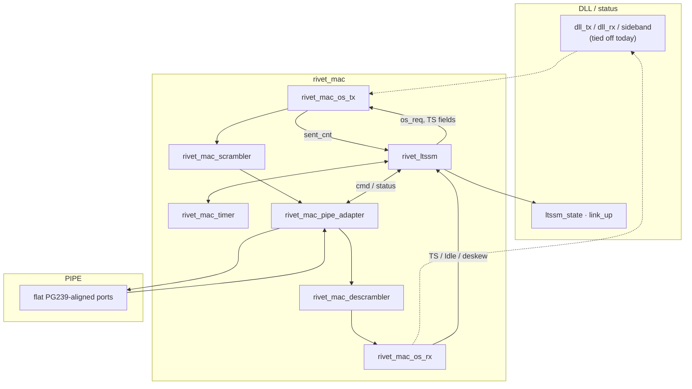

# MAC (`rtl/pcie_ctrl/mac`)

Gen2 Media Access Control (`pclk`). Detail / roadmap: [docs/mac.md](../../../docs/mac.md).

## Block diagram



## Hierarchy

```text
rivet_mac
├── rivet_ltssm
│   └── rivet_mac_timer
├── rivet_mac_os_tx
├── rivet_mac_scrambler
├── rivet_mac_descrambler
├── rivet_mac_os_rx
└── rivet_mac_pipe_adapter
```

## Modules

| Module | Role |
|--------|------|
| `rivet_mac` | Top wrapper; wires the blocks below |
| `rivet_ltssm` | Link training state machine (Detect → … → L0) |
| `rivet_mac_timer` | Shared LTSSM timeout counter |
| `rivet_mac_os_tx` | Ordered-set / TS encoder; ×1 SDP DLLP framing |
| `rivet_mac_os_rx` | Ordered-set / TS / Idle detect; ×1 SDP → DLL RX |
| `rivet_mac_scrambler` | Gen2 TX per-lane LFSR |
| `rivet_mac_descrambler` | Gen2 RX per-lane LFSR |
| `rivet_mac_pipe_adapter` | Symbol + LTSSM commands ↔ flat PIPE |

DLL↔MAC types: [`../dll/rivet_dll_mac_if.sv`](../dll/rivet_dll_mac_if.sv).
DLLP CRC: [`../dll/rivet_dll_crc16.sv`](../dll/rivet_dll_crc16.sv).
