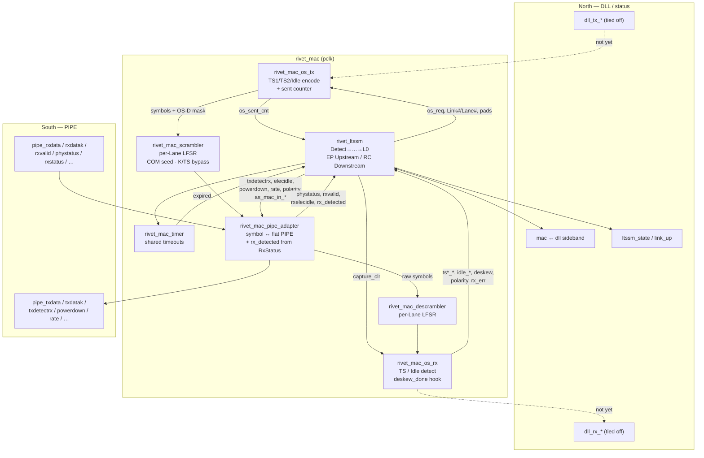

# MAC (`rtl/pcie_ctrl/mac`)

Gen2 Media Access Control inside `rivet_pcie_ctrl` (`pclk` domain).  
Style: [docs/rtl-style.md](../../../docs/rtl-style.md). Checklist: [docs/mac.md](../../../docs/mac.md).

**Status today:** Detect → … → L0 proven (Verilator smoke, Questa UVM, PG239 BFM).  
DLL payload path and framing/SKP are still open (M2 remainder).

---

## 1. Context — where MAC sits

```text
  AXI-ST CQ/CC/RQ/RC + cfg_mgmt          ← user (TL / cfg)
                 │
            TL + DLL stubs
                 │
       ┌─────────┴─────────┐
       │     ★  MAC  ★     │   LTSSM, OS, scramble, PIPE
       └─────────┬─────────┘
                 │ PIPE (PG239-aligned)
                 ▼
         PHY wrapper / PG239             ← 8b/10b, EB, SerDes
```

| MAC owns (Gen2) | Not in MAC |
|-----------------|------------|
| LTSSM + timers | 8b/10b, elastic buffer (PHY) |
| TS / Idle OS TX & RX | LCRC / ACK / credits (DLL) |
| Scrambler / descrambler | AXI-ST user ports (TL) |
| PIPE command / status | Framing / striping / SKP (M2 TODO) |

---

## 2. IBD — blocks inside `rivet_mac`



### Control vs data (same IBD, roles)

| Path | Blocks | What moves |
|------|--------|------------|
| **Control** | `ltssm` ↔ `os_rx` / `os_tx` / `timer` / `pipe_adapter` | State, OS request, TS fields, Detect/P1/P0, polarity |
| **TX data** | `os_tx` → `scrambler` → `pipe_adapter` → PIPE | Ordered-set / Idle symbols (DLL beats later) |
| **RX data** | PIPE → `pipe_adapter` → `descrambler` → `os_rx` | Symbols in; training flags out to LTSSM |

---

## 3. TX / RX slice (one Symbol Time @ 16-bit PIPE)

```text
  TX (training today)
  ─────────────────
  LTSSM: os_req = TS1 | TS2 | IDLE
      → os_tx builds COM + fields + TS ID  (2 symbols / cycle / lane)
      → scrambler (Idle D scrambled; K and TS D bypass)
      → pipe_adapter packs LANES × 16 → pipe_txdata*

  RX
  ──
  pipe_rxdata*
      → pipe_adapter unpack
      → descrambler
      → os_rx sliding window: classify TS1/TS2 shapes, Idle=00h
      → reductions (any/all) + deskew_done → LTSSM exits
```

Partner must be a **Downstream Port** at Configuration (offers Link# then Lane#).  
EP-only dual shells stall at `0x05` Linkwidth.Start — BFM uses `MODE=RC` peer; UVM uses `rivet_pipe_ltssm_peer`.

---

## 4. Module index

| Module | Role |
|--------|------|
| `rivet_mac` | Wrapper: wires the blocks above |
| `rivet_ltssm` | LTSSM (PG213 encodings); EP + RC/DSP Config |
| `rivet_mac_timer` | One shared timeout counter |
| `rivet_mac_os_tx` | OS/TS encode; DLL mux tied off |
| `rivet_mac_os_rx` | OS/TS / Idle detect; deskew hook |
| `rivet_mac_scrambler` | Gen2 TX LFSR |
| `rivet_mac_descrambler` | Gen2 RX LFSR |
| `rivet_mac_pipe_adapter` | Symbol/command ↔ flat PIPE |

DLL↔MAC structs/IF: [`../dll/rivet_dll_mac_if.sv`](../dll/rivet_dll_mac_if.sv).

---

## 5. Not drawn yet (M2+)

```text
  DLL beats ──► framer (STP/SDP/END/EDB) ──► striping ──► os_tx mux
  os_rx ──► unstripe / deskew buffer ──► deframer ──► DLL beats
  L0: rivet_mac_skp  (SKP every 1180–1538 Symbol Times)
```

Those boxes plug into the same `os_tx` / `os_rx` ↔ scrambler paths once framing lands.
